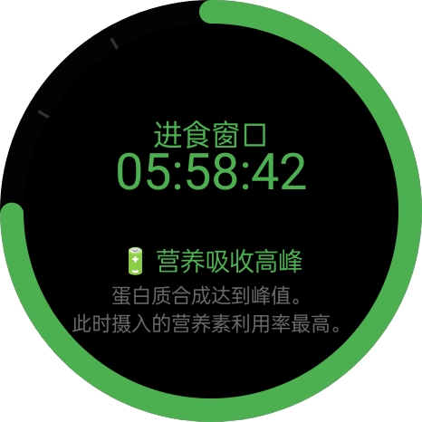
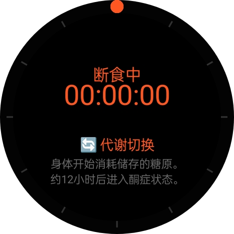

# CircleFast 🎯

<p align="center">
  
</p>

<p align="center">
  <strong>168 间歇性断食计时 App</strong> — 专为 OPPO Watch x3（ColorOS Watch）设计。
  <br>
  圆形 AMOLED 表盘，一屏搞定断食计时。
</p>

---

## 功能

- ⭕ 圆形 Canvas 倒计时圆环，适配圆屏
- 🔔 仅阶段切换时推送通知（断食开始/结束、进食结束），无常驻通知
- 🌑 纯黑深色主题，AMOLED 省电
- 🧠 断食期间实时科普 — 你的身体正在发生什么
- 🍽️ 进食窗口 8 小时倒计时 + 科普
- 🔄 设备重启自动恢复计时
- ⚡ 冷启动 < 500ms，APK < 1MB

## 截图

<p align="center">
  
  
</p>

## 安装

### 手表开启 ADB

1. **设置 → 关于手表 → 连续点击版本号 5 次**（开启开发者模式）
2. **设置 → 其他设置 → 开发者选项 → USB 调试（打开）**
3. 设置 → 应用管理 → CircleFast → 省电策略 → **不受限制**（确保通知准时到达）

### 安装 APK

```bash
adb connect <手表IP>
adb install app-debug.apk
```

## 开发

```bash
# 编译 Debug APK
./gradlew assembleDebug

# 输出位置
app/build/outputs/apk/debug/app-debug.apk
```

## 技术栈

| 层 | 技术 |
|----|------|
| 语言 | **Kotlin** |
| UI | **Jetpack Compose**（标准版，非 Wear OS） |
| 后台计时 | **AlarmManager**（无前台 Service，零续航影响） |
| 存储 | **SharedPreferences** |
| 通知 | **NotificationCompat** + Vibrator |
| 最低 SDK | API 26 (Android 8.0) |

## 许可证

MIT

---

<p align="center">
  <sub>Made with ❤️ by <strong>Vim</strong> — 你手边的 AI 开发搭档 🎮</sub>
  <br>
  <sub>Built for 兴逸's OPPO Watch x3</sub>
</p>
